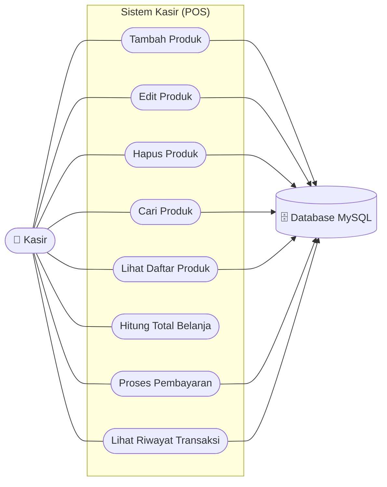
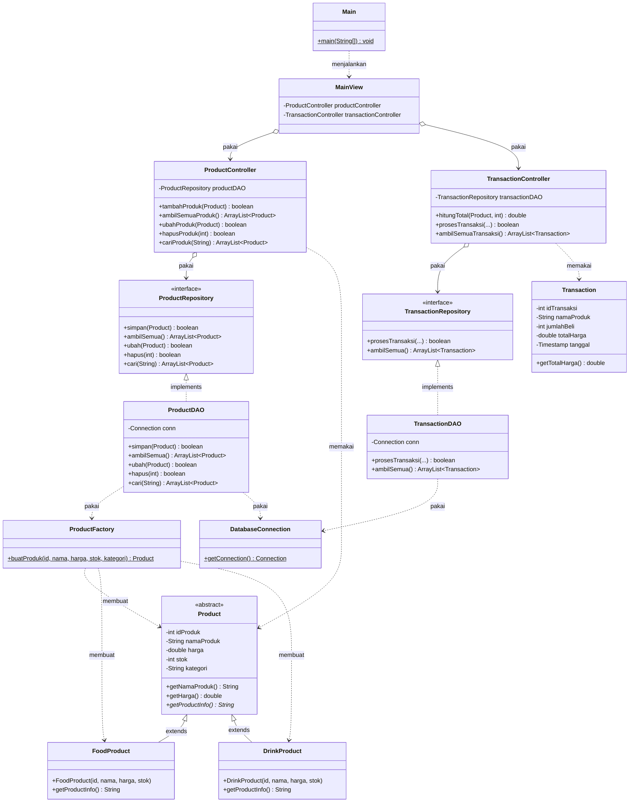

# Penjelasan Code — Aplikasi Sistem Kasir (POS)

Dokumen ini menjelaskan isi kode, penerapan konsep **OOP** (4 pilar) dan prinsip desain **SOLID**, serta alur kerja aplikasi. Ditulis untuk pemula yang baru belajar Java.

---

## Daftar Isi
1. [Gambaran Umum](#1-gambaran-umum)
2. [Pola Arsitektur (MVC + DAO)](#2-pola-arsitektur-mvc--dao)
3. [Penjelasan Tiap File](#3-penjelasan-tiap-file)
4. [Penerapan 4 Pilar OOP](#4-penerapan-4-pilar-oop)
5. [Penerapan Prinsip SOLID](#5-penerapan-prinsip-solid)
6. [Konsep Java Lain yang Dipakai](#6-konsep-java-lain-yang-dipakai)
7. [Alur Kerja Aplikasi](#7-alur-kerja-aplikasi)
8. [Diagram UML](#8-diagram-uml)
9. [Validasi Input & Penanganan Edge Case](#9-validasi-input--penanganan-edge-case)

---

## 1. Gambaran Umum

Aplikasi kasir sederhana berbasis **Java Swing** + **MySQL**. Fitur:
- **Kelola Produk** — tambah, edit, hapus, cari (CRUD).
- **Transaksi Kasir** — pilih produk, hitung total, bayar (stok otomatis berkurang).
- **Riwayat Transaksi** — daftar semua penjualan.

Database dan tabel dibuat **otomatis** saat aplikasi pertama dijalankan.

---

## 2. Pola Arsitektur (MVC + DAO)

Kode dipisah menjadi beberapa lapisan agar tiap bagian punya satu tugas jelas:

```
┌─────────────┐   ┌──────────────┐   ┌──────────┐   ┌──────────┐
│    VIEW     │ → │  CONTROLLER  │ → │   DAO    │ → │ DATABASE │
│ (tampilan)  │   │  (jembatan)  │   │  (SQL)   │   │  (MySQL) │
└─────────────┘   └──────────────┘   └──────────┘   └──────────┘
       ↑                  ↑                ↑
       └──────────────────┴────────────────┘
                      MODEL (data)
```

| Lapisan | Folder | Tugas |
|---------|--------|-------|
| **Model** | `model/` | Menyimpan data (apa itu Produk / Transaksi) |
| **View** | `view/` | Tampilan GUI Swing, menerima input pengguna |
| **Controller** | `controller/` | Jembatan View ↔ DAO + logika bisnis (validasi, hitung) |
| **DAO** | `dao/` | Satu-satunya yang menyentuh database (SQL) |
| **Database** | `database/` | Mengatur koneksi JDBC |

**Aturan main:** tiap lapisan hanya bicara dengan tetangganya. View tidak menulis SQL. DAO tidak mengurus tampilan.

---

## 3. Penjelasan Tiap File

### `main/Main.java`
Titik awal program (`public static void main`). Membuat objek `MainView` lalu menampilkannya. Memakai `SwingUtilities.invokeLater` agar GUI berjalan di thread yang aman.

### `database/DatabaseConnection.java`
Mengatur koneksi ke MySQL lewat **JDBC**. Saat pertama dipanggil:
1. Connect ke server MySQL (tanpa nama database).
2. `CREATE DATABASE IF NOT EXISTS kasir_db` — buat database kalau belum ada.
3. `CREATE TABLE IF NOT EXISTS ...` — buat tabel `products` & `transactions`.
4. Isi data contoh **hanya jika** tabel masih kosong (cegah data dobel).

Memakai pola **single connection**: koneksi dibuat sekali lalu dipakai ulang.

### `model/Product.java`
**Abstract class** (blueprint dasar produk). Semua atribut `private` (Encapsulation), diakses lewat getter/setter. Punya **abstract method** `getProductInfo()` yang wajib diisi oleh class anak.

### `model/FoodProduct.java` & `model/DrinkProduct.java`
Class anak (`extends Product`). Memanggil constructor induk lewat `super(...)` dengan kategori "Makanan"/"Minuman". Meng-**override** `getProductInfo()` dengan format berbeda.

### `model/ProductFactory.java`
Kelas "pabrik". Tugasnya memutuskan: kategori "Makanan" → buat `FoodProduct`, selain itu → `DrinkProduct`. Keputusan ini ditulis **satu kali** di sini, supaya tidak ada `if-else` yang sama tersebar di View & Controller.

### `model/Transaction.java`
Model data satu baris transaksi: id, nama produk, jumlah beli, total harga, tanggal. Semua atribut `private` + getter/setter.

### `dao/ProductRepository.java` & `dao/TransactionRepository.java`
**Interface** (kontrak). Berisi daftar method tanpa isi. Dipakai untuk prinsip **Interface Segregation** dan **Dependency Inversion** (lihat bagian SOLID).

### `dao/ProductDAO.java`
`implements ProductRepository`. Berisi SEMUA SQL produk: `INSERT` (simpan), `SELECT` (ambilSemua/cari), `UPDATE` (ubah), `DELETE` (hapus). Memakai **PreparedStatement** agar aman dari SQL Injection. Method `bacaSatuBaris()` mengubah hasil database jadi objek `Product` lewat `ProductFactory`.

### `dao/TransactionDAO.java`
`implements TransactionRepository`. Memproses transaksi dengan **Database Transaction**:
- `setAutoCommit(false)` → matikan simpan otomatis.
- Kurangi stok, lalu catat riwayat.
- `commit()` jika semua sukses, `rollback()` jika ada yang gagal.

Tujuannya: kalau stok gagal dikurangi, riwayat juga tidak tersimpan (data tetap konsisten).

### `controller/ProductController.java`
Jembatan View ↔ `ProductDAO`. Menyediakan: `buatProduk`, `tambahProduk`, `ambilSemuaProduk`, `ubahProduk`, `hapusProduk`, `cariProduk`. Field-nya bertipe **interface** `ProductRepository` (bukan kelas konkret).

### `controller/TransactionController.java`
Jembatan View ↔ `TransactionDAO`. Berisi logika bisnis `hitungTotal(produk, jumlah)` = harga × jumlah, plus `prosesTransaksi` dan `ambilSemuaTransaksi`.

### `view/MainView.java`
GUI Swing (`JFrame`). Memakai `JTabbedPane` untuk 3 tab. Berisi `JTable`, `JTextField`, `JButton`, `JComboBox`. Menangkap event klik (`ActionListener`, `MouseListener`). Ada juga **Multithreading** untuk jam digital di header.

---

## 4. Penerapan 4 Pilar OOP

### a. Abstraction (Abstraksi)
> Menyembunyikan detail rumit, hanya menampilkan yang penting.

- `Product` adalah **abstract class** — tidak bisa dibuat objek langsung (`new Product()` dilarang). Memaksa pemakaian lewat class anak.
- Method **abstract** `getProductInfo()` — induk hanya mendeklarasikan "harus ada method ini", isinya diserahkan ke anak.
- **Interface** `ProductRepository` & `TransactionRepository` — kontrak murni tanpa isi.

```java
public abstract class Product {
    public abstract String getProductInfo(); // wajib diisi class anak
}
```

### b. Encapsulation (Pengkapsulan)
> Membungkus data agar tidak diakses sembarangan dari luar.

- Semua atribut di `Product` dan `Transaction` bersifat **`private`**.
- Akses hanya lewat **getter/setter**.

```java
public abstract class Product {
    private double harga;                     // dibungkus, tak bisa diakses langsung
    public double getHarga() { return harga; } // akses lewat method
    public void setHarga(double harga) { this.harga = harga; }
}
```

### c. Inheritance (Pewarisan)
> Class anak mewarisi atribut & method dari class induk.

- `FoodProduct` dan `DrinkProduct` memakai `extends Product`.
- Memanggil constructor induk dengan `super(...)`.

```java
public class FoodProduct extends Product {
    public FoodProduct(int id, String nama, double harga, int stok) {
        super(id, nama, harga, stok, "Makanan"); // pakai constructor induk
    }
}
```

### d. Polymorphism (Polimorfisme)
> "Banyak bentuk" — satu nama, perilaku berbeda.

Dua bentuk dipakai:

**1. Overriding** — method sama, isi beda di tiap anak:
```java
// FoodProduct
public String getProductInfo() { return "[Makanan] " + getNamaProduk() + " ..."; }
// DrinkProduct
public String getProductInfo() { return "[Minuman] " + getNamaProduk() + " ..."; }
```
Saat dipanggil `p.getProductInfo()` di combobox, Java otomatis memilih versi yang benar sesuai jenis objek asli (walau tipe variabelnya `Product`). Ini juga contoh **Upcasting** (objek anak disimpan di `ArrayList<Product>`).

**2. Overloading** — nama constructor sama, parameter beda:
```java
public ProductController() { ... }                          // tanpa parameter
public ProductController(ProductRepository repo) { ... }    // dengan parameter
```

---

## 5. Penerapan Prinsip SOLID

### S — Single Responsibility Principle
> Satu class, satu tanggung jawab.

Tiap lapisan punya satu tugas: `MainView` (tampilan), `ProductController` (jembatan), `ProductDAO` (SQL), `Product` (data). Tidak dicampur.

### O — Open/Closed Principle
> Terbuka untuk ditambah, tertutup untuk diubah.

Mau menambah jenis produk baru (misal "Snack")? Cukup buat class baru `extends Product` dan meng-override `getProductInfo()`. Lapisan lain (DAO, Controller, View) tidak perlu diubah karena memakai tipe `Product` dan polymorphism.

### L — Liskov Substitution Principle
> Objek anak harus bisa menggantikan objek induk tanpa merusak program.

`FoodProduct` dan `DrinkProduct` bisa disimpan bersama di `ArrayList<Product>` dan diperlakukan sama. Program tetap jalan benar.

```java
ArrayList<Product> daftar = new ArrayList<>();
daftar.add(new FoodProduct(...));   // anak menggantikan induk
daftar.add(new DrinkProduct(...));
```

### I — Interface Segregation Principle
> Interface harus kecil dan fokus, jangan gemuk.

Dibuat dua interface terpisah: `ProductRepository` (khusus produk) dan `TransactionRepository` (khusus transaksi). Tidak digabung jadi satu interface besar, jadi tidak ada method yang menganggur.

### D — Dependency Inversion Principle
> Bergantung pada abstraksi (interface), bukan pada kelas konkret.

`ProductController` menyimpan field bertipe **interface** `ProductRepository`, bukan kelas `ProductDAO`. Jadi kalau nanti cara simpan data diganti (misal ke file), Controller tidak perlu diubah.

```java
private ProductRepository productDAO;                 // tipe interface (abstraksi)
public ProductController() { productDAO = new ProductDAO(); }
public ProductController(ProductRepository repo) { productDAO = repo; } // bisa diganti
```

---

## 6. Konsep Java Lain yang Dipakai

| Konsep | Di mana | Penjelasan |
|--------|---------|------------|
| **Constructor** | Semua model | Memberi nilai awal saat objek dibuat |
| **Exception Handling** | DAO & View | `try-catch` untuk `SQLException` & `NumberFormatException` |
| **Collection (ArrayList)** | DAO & View | Menampung daftar produk/transaksi sebelum ditampilkan |
| **JDBC** | DatabaseConnection, DAO | Menghubungkan Java ke MySQL |
| **PreparedStatement** | DAO | Query aman dari SQL Injection (pakai tanda `?`) |
| **Database Transaction** | TransactionDAO | `commit()`/`rollback()` agar data konsisten |
| **Multithreading** | MainView | Jam digital berjalan di Thread terpisah |
| **Event Handling** | MainView | `ActionListener`, `MouseListener` untuk klik tombol/tabel |
| **Validasi Input** | MainView & Controller | Cek 2 lapis agar data tidak masuk akal ditolak (lihat bagian 9) |

---

## 7. Alur Kerja Aplikasi

### Contoh: Tambah Produk
```
1. User isi form di MainView, klik tombol "Tambah"
2. MainView → ProductController.buatProduk()  (pakai ProductFactory)
3. MainView → ProductController.tambahProduk(produk)
4. ProductController → ProductDAO.simpan(produk)
5. ProductDAO jalankan INSERT ke MySQL
6. Tabel di layar di-refresh
```

### Contoh: Proses Transaksi (Bayar)
```
1. User pilih produk + jumlah, klik "Bayar"
2. MainView ambil objek Product terpilih (lewat index combobox)
3. ProductController/TransactionController.hitungTotal(produk, jumlah)
4. TransactionController.prosesTransaksi(produk, jumlah, total)
5. TransactionDAO:
   - setAutoCommit(false)
   - UPDATE stok (jika cukup)
   - INSERT riwayat
   - commit() jika sukses / rollback() jika gagal
6. Stok & riwayat di layar di-refresh
```

---

> **Ringkasan:** Aplikasi ini menerapkan 4 pilar OOP (Abstraction, Encapsulation, Inheritance, Polymorphism) dan 5 prinsip SOLID secara nyata melalui arsitektur berlapis MVC + DAO, dengan kode yang sengaja dibuat sederhana dan berkomentar Bahasa Indonesia agar mudah dipelajari pemula.

---

## 8. Diagram UML

Dibuat sebelum coding sebagai rancangan. Diagram di bawah memakai **Mermaid** (otomatis ter-render sebagai gambar saat dibuka di GitHub).

### a. Use Case Diagram
Menjelaskan apa saja yang bisa dilakukan **Kasir** (pengguna) terhadap sistem.



**Keterangan:**
- **Aktor:** Kasir (satu-satunya pengguna sistem).
- **Use case Produk:** Tambah, Edit, Hapus, Cari, Lihat daftar (CRUD).
- **Use case Transaksi:** Hitung Total, Proses Pembayaran (mengurangi stok + mencatat riwayat).
- **Use case Riwayat:** Lihat semua riwayat penjualan.
- Sebagian besar use case berinteraksi dengan **Database MySQL** untuk menyimpan/mengambil data. *Hitung Total* tidak ke database karena hanya perhitungan di memori.

### b. Class Diagram
Menjelaskan hubungan antar class beserta atribut dan method utamanya.



**Cara membaca simbol panah:**

| Simbol | Arti | Contoh di diagram |
|--------|------|-------------------|
| `<|--` | **Inheritance** (extends) | `FoodProduct` mewarisi `Product` |
| `<|..` | **Realization** (implements interface) | `ProductDAO` mengimplementasi `ProductRepository` |
| `o-->` | **Aggregation** (punya/pakai objek lain) | `ProductController` punya `ProductRepository` |
| `..>`  | **Dependency** (sekadar memakai) | `ProductDAO` memakai `ProductFactory` |

**Hubungan utama yang terlihat:**
- `FoodProduct` & `DrinkProduct` adalah turunan `Product` → **Inheritance**.
- `ProductDAO` & `TransactionDAO` mematuhi kontrak interface → **Abstraction + ISP**.
- `Controller` bergantung pada **interface** repository, bukan DAO konkret → **Dependency Inversion**.
- `MainView` hanya berhubungan dengan Controller, tidak langsung ke DAO/Database → **lapisan MVC terjaga**.

> **Catatan:** Diagram di atas memakai Mermaid agar bisa langsung ditampilkan di GitHub/VS Code. Untuk laporan resmi, diagram yang sama bisa digambar ulang di tools seperti **draw.io**, **StarUML**, atau **Lucidchart**.

---

## 9. Validasi Input & Penanganan Edge Case

Aplikasi memeriksa input pengguna agar data yang aneh (negatif, nol, kosong) tidak masuk ke database. Pemeriksaan dilakukan **dua lapis**: di View (memberi pesan ke pengguna) dan di Controller (jaring pengaman logika bisnis).

### Edge case yang ditangani

| Kasus | Bahaya kalau dibiarkan | Penanganan |
|-------|------------------------|------------|
| **Jumlah beli negatif** (mis. -1) | SQL `stok - (-1)` membuat stok malah **bertambah** | Ditolak di View + Controller (`jumlah <= 0` → batal) |
| **Jumlah beli 0** | Transaksi tercatat dengan total Rp 0 | Minimal jumlah 1 |
| **Harga ≤ 0** | Produk berharga 0 / negatif tersimpan | Harus lebih dari 0 |
| **Stok negatif** | Stok minus tidak masuk akal | Stok minimal 0 |
| **Nama produk kosong / hanya spasi** | Produk tanpa nama tersimpan | `trim()` lalu cek kosong |

### Lapis 1 — Validasi di View (`MainView`)
Memberi pesan jelas sebelum data dikirim. Contoh:

```java
private boolean produkValid(String nama, double harga, int stok) {
    if (nama.isEmpty()) {
        JOptionPane.showMessageDialog(this, "Nama produk tidak boleh kosong!");
        return false;
    }
    if (harga <= 0) {
        JOptionPane.showMessageDialog(this, "Harga harus lebih dari 0!");
        return false;
    }
    if (stok < 0) {
        JOptionPane.showMessageDialog(this, "Stok tidak boleh negatif!");
        return false;
    }
    return true;
}
```

### Lapis 2 — Jaring pengaman di Controller
Walaupun View lupa memeriksa, Controller tetap menolak data yang tidak masuk akal sebelum menyentuh database:

```java
// ProductController
private boolean produkMasukAkal(Product product) {
    if (product.getNamaProduk() == null || product.getNamaProduk().trim().isEmpty()) return false;
    if (product.getHarga() <= 0) return false;
    return product.getStok() >= 0;
}

// TransactionController
public boolean prosesTransaksi(Product produk, int jumlahBeli, double totalHarga) {
    if (jumlahBeli <= 0) return false; // cegah stok bertambah karena angka negatif
    ...
}
```

### Kenapa dua lapis?
- **View** ramah pengguna: kasih tahu *apa* yang salah lewat pesan.
- **Controller** menjaga aturan bisnis: kalau nanti ada tombol/menu baru yang lupa validasi, data tetap aman. Ini menerapkan prinsip *"jangan percaya input"* dan menjaga **Single Responsibility** (View urus pesan, Controller urus aturan).
